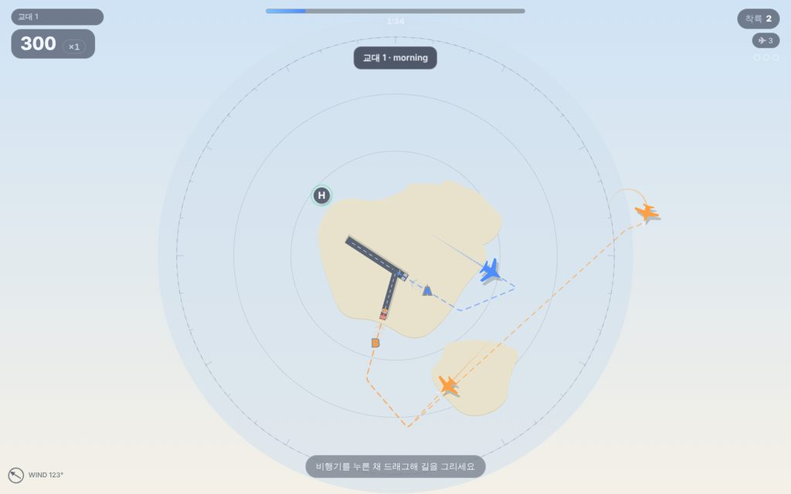
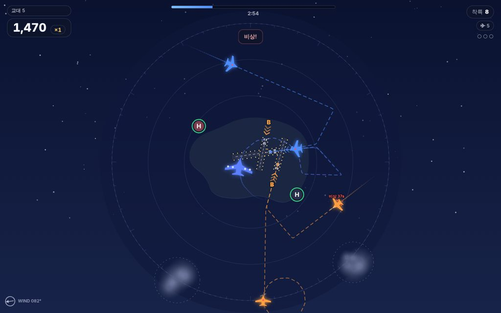

# 맥북 앱·게임 — ClipMint & APPROACH

Claude Code·Codex로 만들어져 극찬받은 맥 앱·게임들의 공통점(네이티브, 가볍고, 오프라인, 키보드 중심, 짧은 세션, 일일 시드, 업그레이드 선택)을 모아 만든 두 개의 macOS 앱입니다.

| | ClipMint (앱) | APPROACH (게임) |
|---|---|---|
| 한 줄 | 메뉴 막대 클립보드 관리자 + 스니펫 + 텍스트 정리 + 이미지 글자 인식(OCR) | 하늘길을 손으로 그려 비행기를 착륙시키는 관제 로그라이트 |
| 기술 | Swift / SwiftUI / AppKit, Vision (100% 네이티브, Electron 아님) | 네이티브 셸(Swift·WKWebView) + Canvas 2D 게임, 사운드·그래픽 전부 코드로 생성 |
| 용량 | 수 MB | 수 MB |
| 네트워크 | 없음 (모든 데이터는 내 Mac 안) | 없음 |
| 지원 | macOS 14 Sonoma 이상, Apple Silicon·Intel 겸용(유니버설) | 동일 |

## 1. 내려받기

GitHub **Releases** 페이지에서 `.dmg` 파일을 받습니다.
→ https://github.com/joofam0819-crypto/claude-cloud/releases

- `ClipMint-1.0.0-mac.dmg`
- `Approach-1.0.0-mac.dmg`

(Releases가 비어 있으면 Actions 탭의 최신 "macOS apps" 실행에서 `mac-apps` 아티팩트를 받아도 됩니다. 로그인 필요.)

## 2. 설치 — "확인되지 않은 개발자" 경고 통과하기 (한 번만)

이 앱들은 Apple 개발자 계정($99/년)으로 서명·공증하지 않았습니다. 그래서 처음 열 때 macOS가 막습니다. 아래 순서대로 **한 번만** 허용하면 이후엔 그냥 열립니다.

1. `.dmg`를 열고 앱 아이콘을 **응용 프로그램(Applications)** 폴더로 끌어 넣습니다.
2. 응용 프로그램 폴더에서 앱을 더블클릭합니다. "Apple이 … 악성 소프트웨어가 없는지 확인할 수 없습니다" 창이 뜨면 **완료(Done)** 를 누릅니다. (우클릭 → 열기는 macOS 15부터 통하지 않습니다.)
3. **시스템 설정 → 개인정보 보호 및 보안** 으로 가서 아래로 내리면 "‘ClipMint’이(가) Mac을 보호하기 위해 차단되었습니다" 문구 옆에 **그래도 열기** 버튼이 있습니다. 누르고 Touch ID/비밀번호를 입력한 뒤, 다시 뜨는 창에서 **열기**를 누릅니다.
4. 두 번째 앱도 같은 방법으로 허용합니다.

**가장 빠른 방법(터미널 한 줄)** — 터미널을 열고 아래 한 줄을 붙여넣고 Enter. 최신 버전 다운로드·설치·차단 해제·실행까지 한 번에 됩니다(`scripts/install-mac-apps.sh`).

```bash
curl -fsSL https://raw.githubusercontent.com/joofam0819-crypto/claude-cloud/main/scripts/install-mac-apps.sh | bash
```

같은 일을 하는 긴 버전(스크립트 없이):

```bash
cd ~/Downloads && curl -L -o ClipMint.zip https://github.com/joofam0819-crypto/claude-cloud/releases/latest/download/ClipMint-1.0.0-mac.zip && curl -L -o Approach.zip https://github.com/joofam0819-crypto/claude-cloud/releases/latest/download/Approach-1.0.0-mac.zip && ditto -x -k ClipMint.zip /Applications && ditto -x -k Approach.zip /Applications && xattr -dr com.apple.quarantine /Applications/ClipMint.app /Applications/Approach.app && open /Applications/ClipMint.app && open /Applications/Approach.app
```

이미 앱을 복사해 두었다면 차단 표시만 지워도 됩니다: `xattr -dr com.apple.quarantine /Applications/ClipMint.app /Applications/Approach.app`

소스 코드는 이 저장소에 전부 공개되어 있고, 앱은 GitHub의 macOS 빌드 서버에서 자동으로 만들어집니다(`.github/workflows/mac-build.yml`).

## 3. ClipMint 사용법

메뉴 막대(화면 위 오른쪽)에 📋 아이콘이 생깁니다. Dock에는 나타나지 않습니다.


**바로 쓸 것 4가지**
1. **⇧⌘V** — 어디서든 복사 기록 패널을 엽니다. 글자를 치면 바로 검색, ↑↓로 고르고 **Enter**로 붙여넣기.
2. **Enter = 서식 없이 붙여넣기** (기본). ⇧Enter는 원래 서식 유지, ⌥Enter는 복사만. ⌘1~9로 위에서 n번째를 바로 붙여넣기.
3. **정리(✨) 메뉴** — PDF에서 복사한 글의 줄바꿈 고치기(끝에 붙은 하이픈도 복원), 공백 정리, 한 줄 만들기, 대소문자, 중복 줄 제거, JSON 정렬 등.
4. **스니펫 탭(Tab 키로 이동)** — 매일 치는 인사말·마무리 문장을 저장. `{date}`, `{date+7}`, `{time}`, `{clipboard}`, `{user}` 같은 자리표시자가 삽입할 때 채워집니다.

**이미지 글자 인식(OCR)** — 스크린샷을 클립보드로 복사하면(⌃⇧⌘4로 영역 선택) 한국어·영어·일본어 글자를 기기 안에서 인식해 검색·복사할 수 있습니다. 권한 필요 없음.

**권한** — 기본은 아무 권한도 요구하지 않습니다. 패널에서 Enter를 누르면 복사가 되고 ⌘V를 누르면 됩니다. "현재 앱에 바로 붙여넣기"를 원하면 설정에서 **손쉬운 사용** 권한을 한 번 허용하세요(⌘V를 대신 눌러 주는 기능).

**개인정보** — 비밀번호 관리자처럼 '숨김' 표시로 복사된 내용은 기록하지 않습니다. 무시할 앱(번들 ID)을 설정에서 추가할 수 있습니다. 데이터 위치: `~/Library/Application Support/ClipMint`.

기타: 로그인 시 자동 실행, 단축키 변경, 보관 개수(기본 500), 이미지 저장·OCR 끄기, 언어(시스템/한국어/English)는 모두 **설정(⌘,)** 에 있습니다. 메뉴 막대 아이콘을 **우클릭**하면 설정·기록 지우기·종료 메뉴가 나옵니다.

## 4. APPROACH 사용법

관제탑에서 비행기를 착륙시키는 게임입니다. 트랙패드·마우스만으로 합니다.

| 아침 교대 | 밤 교대 | 업그레이드 선택 |
|---|---|---|
|  |  |  |

**조작**
- 비행기를 **누른 채 끌어** 길을 그립니다. 손을 떼면 그 길을 따라갑니다.
- 비행기 색과 **같은 색 활주로**에, 활주로 **화살표 방향**에 맞춰 들어가면 착륙합니다. 파란색 = 활주로 A(제트·대형기), 주황색 = 활주로 B(터보프롭), 녹색 H = 헬리콥터 패드(방향 무관).
- 비행기끼리 가까워지면 빨간 경고가 뜨고 점수가 깎입니다. **부딪히면 근무 종료**입니다.
- 연료가 바닥나기 전에 착륙시키세요. 빨갛게 깜빡이는 비상 항공기는 보너스가 큽니다. 폭풍 구름은 피하세요.
- 한 교대(2~4분)를 버티면 **업그레이드 3개 중 하나**를 고릅니다(ILS 착륙 각도 완화, TCAS 자동 회피, 연료 협약, 슬로모션, 광역 레이더, 성과급 등). 교대가 올라갈수록 교통량이 늘고 아침→황혼→밤으로 시간이 흐릅니다.
- **오늘의 교대**: 날짜로 정해진 같은 교통 상황을 3분 동안 관제해 최고 점수를 겨룹니다. 결과를 **복사**해 메신저에 붙일 수 있습니다.

**키보드** — Space 일시 정지(관제 집중 업그레이드가 있으면 누르는 동안 슬로모션), 1·2·3 업그레이드 선택, R 다시 시작, M 음소거, F 전체 화면, Esc 메뉴.

게임은 브라우저에서도 동작합니다: `mac/approach/web/index.html`.

## 5. 폴더 구성

```
mac/
  clipmint/   Swift 패키지 (ClipMintCore: 로직·단위 테스트 / ClipMint: 앱)
  approach/   Swift 셸(WKWebView) + web/ (게임 본체: HTML·CSS·JS)
  tests/      sim.test.mjs (시뮬레이션 단위 테스트), run-web-tests.mjs (Playwright 브라우저 테스트), balance.mjs (AI 관제사 난이도 리포트)
scripts/build-mac-app.sh   .app 번들 생성·ad-hoc 서명·zip/dmg 패키징 (macOS에서 실행)
.github/workflows/mac-build.yml   푸시마다 테스트 + macOS 빌드, 수동 실행 시 Release 발행
```

직접 빌드하려면 Mac에서 Xcode(또는 Command Line Tools)를 설치한 뒤:

```bash
scripts/build-mac-app.sh mac/clipmint dist
scripts/build-mac-app.sh mac/approach dist
```
