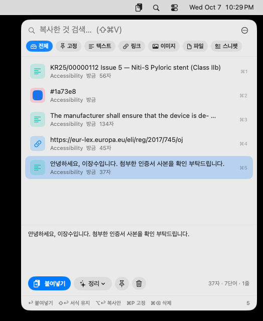

# ClipMint — 맥 메뉴 막대 클립보드 관리자

Claude Code·Codex로 만들어져 극찬받은 맥 앱들의 공통점(네이티브, 가볍고, 오프라인, 키보드 중심, 권한 최소)을 모아 만든 macOS 앱입니다.

- 한 줄: 복사한 것을 전부 기억했다가 골라서 다시 붙여넣는 앱 + 스니펫 + 텍스트 정리 + 이미지 글자 인식(OCR)
- 기술: Swift / SwiftUI / AppKit, Vision (100% 네이티브, Electron 아님), 용량 수 MB
- 네트워크 없음 (모든 데이터는 내 Mac 안), macOS 14 Sonoma 이상, Apple Silicon·Intel 겸용(유니버설)



## 1. 설치

**가장 빠른 방법(터미널 한 줄)** — ⌘+Space → `터미널` → Enter 로 터미널을 열고 아래 한 줄을 붙여넣고 Enter. 최신 버전 다운로드·설치·차단 해제·실행까지 한 번에 됩니다(`scripts/install-mac-apps.sh`).

```bash
curl -fsSL https://raw.githubusercontent.com/joofam0819-crypto/claude-cloud/main/scripts/install-mac-apps.sh | bash
```

**수동 설치** — GitHub **Releases**(https://github.com/joofam0819-crypto/claude-cloud/releases)에서 `ClipMint-1.0.0-mac.dmg`를 받아 열고, 앱을 응용 프로그램 폴더로 끌어 넣습니다. 처음 열 때 "Apple이 … 확인할 수 없습니다" 창이 뜨면 **완료**를 누른 뒤 **시스템 설정 → 개인정보 보호 및 보안 → 그래도 열기**를 한 번 누릅니다(Apple 개발자 서명·공증을 받지 않은 앱이라 뜨는 안내. 우클릭 → 열기는 macOS 15부터 통하지 않습니다). 터미널로 차단 표시만 지우려면: `xattr -dr com.apple.quarantine /Applications/ClipMint.app`

소스 코드는 이 저장소에 전부 공개되어 있고, 앱은 GitHub의 macOS 빌드 서버에서 자동으로 만들어집니다(`.github/workflows/mac-build.yml`).

## 2. 사용법

메뉴 막대(화면 위 오른쪽)에 📋 아이콘이 생깁니다. Dock에는 나타나지 않습니다.

1. **복사는 평소처럼** ⌘C. 아무것도 안 해도 자동으로 기록됩니다.
2. **다시 붙여넣고 싶을 때**: 글 쓰던 자리에서 **⇧⌘V** → 작은 창이 뜸 → ↑↓로 고르거나 글자 몇 자 치면 검색 → **Enter**. 처음에는 "복사됨 — ⌘V로 붙여넣으세요"라고 뜨니 ⌘V를 한 번 더 누르면 됩니다.
3. **한 번만 할 설정**: 창 오른쪽 위 **⋯ → 설정** → "손쉬운 사용 설정 열기" → 시스템 설정에서 ClipMint 스위치 켜기. 이후엔 Enter 한 번에 바로 붙여넣기됩니다.
4. **PDF에서 복사한 글이 줄마다 끊겨 있을 때**: 창에서 그 항목을 고르고 아래 **✨정리 → PDF 줄바꿈 고치기** → 깔끔해진 새 항목이 맨 위에 생김 → Enter.
5. **매일 치는 문장 저장(스니펫)**: 창에서 **Tab** 키로 "스니펫" 탭 → **+ 새 스니펫** → 제목·내용 입력 → 저장. 내용에 `{date}`를 넣으면 붙여넣을 때 오늘 날짜로 바뀝니다(`{date+7}`, `{time}`, `{clipboard}`, `{user}`도 가능).
6. **화면 글자 긁어 오기(OCR)**: **⌃⇧⌘4** 로 영역을 드래그(클립보드로 복사됨) → ⇧⌘V 창에서 그 이미지 항목을 고르면 한국어·영어·일본어 글자가 이미 읽혀 있어서 Enter로 글자만 붙여넣습니다. 권한 필요 없음.

키: Enter 서식 없이 붙여넣기 · ⇧Enter 원래 서식 유지 · ⌥Enter 복사만 · ⌘1~9 위에서 n번째 바로 붙여넣기 · ⌘P 고정 · ⌘⌫ 삭제 · Esc 닫기. 메뉴 막대 📋 아이콘을 눌러도 창이 열리고, **우클릭**하면 설정·기록 지우기·종료 메뉴가 나옵니다.

**개인정보** — 비밀번호 관리자처럼 '숨김' 표시로 복사된 내용은 기록하지 않습니다. 무시할 앱(번들 ID)을 설정에서 추가할 수 있습니다. 데이터 위치: `~/Library/Application Support/ClipMint`. 로그인 시 자동 실행, 단축키 변경, 보관 개수(기본 500), 이미지 저장·OCR 끄기, 언어(시스템/한국어/English)는 모두 **설정(⌘,)** 에 있습니다.

## 3. 폴더 구성

```
mac/clipmint/   Swift 패키지 (ClipMintCore: 로직·단위 테스트 / ClipMint: 앱)
scripts/build-mac-app.sh      .app 번들 생성·ad-hoc 서명·zip/dmg 패키징 (macOS에서 실행)
scripts/install-mac-apps.sh   최신 릴리스 설치 스크립트
.github/workflows/mac-build.yml   푸시마다 테스트 + macOS 빌드, 수동 실행 시 Release 발행
```

직접 빌드하려면 Mac에서 Xcode(또는 Command Line Tools)를 설치한 뒤: `scripts/build-mac-app.sh mac/clipmint dist`
